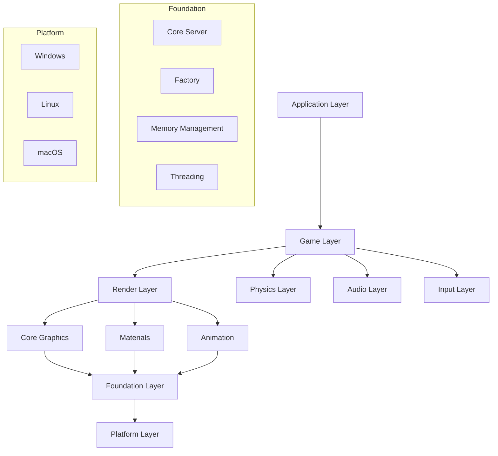
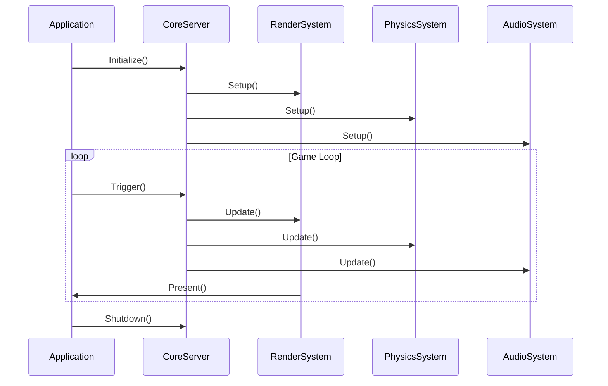
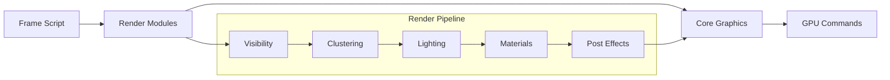
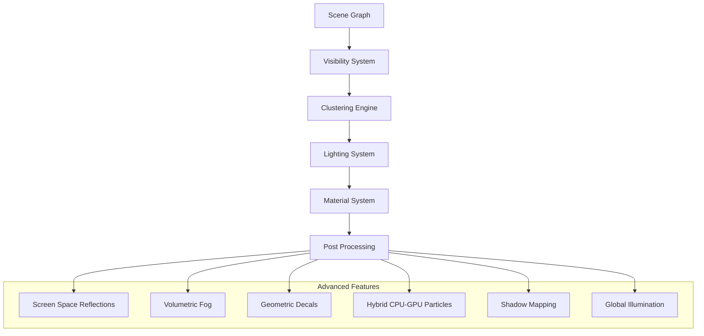
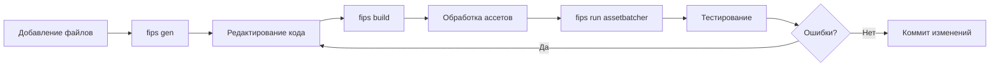

# Nebula Engine - Документация проекта

## Быстрый старт

### Клонирование репозитория

```bash
# Клонирование основного репозитория Nebula Engine
git clone https://github.com/gscept/nebula.git
cd nebula

# Клонирование этого репозитория с документацией
git clone https://github.com/FitoDomik/Nebula-Engine.git
cd Nebula-Engine

# Копирование документации в основной репозиторий (опционально)
cp README.md ../nebula/
```

### Альтернативный способ получения полного проекта

```bash
# Клонирование с подмодулями (если настроены)
git clone --recursive https://github.com/FitoDomik/Nebula-Engine.git
cd Nebula-Engine

# Или клонирование с последующим обновлением подмодулей
git clone https://github.com/FitoDomik/Nebula-Engine.git
cd Nebula-Engine
git submodule update --init --recursive
```

## Обзор

Nebula Engine - это современный игровой движок, написанный на C++. Проект представляет собой модульную архитектуру с четким разделением ответственности между компонентами.

## Требования к системе

### Системные требования
- **ОС**: Windows и Linux (в разработке)
- **Компилятор**: Поддержка C++20
- **Графика**: GPU и драйверы, поддерживающие Vulkan 1.2+
- **CMake**: 3.21+
- **Python**: 3.5+

### Требования к Python (Windows)
- Соответствующая архитектура (64-битная, если сборка выполняется для 64-битных систем)
- Установлено для всех пользователей
- Добавлено в PATH
- Установлено с отладочными символами и исполняемыми файлами

### Дополнительные инструменты
- **Vulkan SDK** и документация Vulkan для отладки конвейера рендеринга
- **Fips** - система управления зависимостями и сборки

## 1. Структура проекта

### Дерево файлов и папок

```
nebula-master/
├── code/                          # Основной исходный код движка
│   ├── foundation/                # Базовые компоненты и утилиты
│   │   ├── app/                   # Приложения и точка входа
│   │   ├── core/                  # Ядро системы
│   │   │   ├── win32/            # Windows-специфичный код
│   │   │   ├── posix/            # POSIX-совместимый код
│   │   │   └── osx/              # macOS-специфичный код
│   │   ├── debug/                # Отладочные инструменты
│   │   ├── fibers/               # Волокна (корутины)
│   │   ├── framesync/            # Синхронизация кадров
│   │   ├── http/                 # HTTP клиент
│   │   ├── ids/                  # Система идентификаторов
│   │   ├── interface/            # Интерфейсы
│   │   ├── io/                   # Ввод-вывод
│   │   ├── jobs/                 # Система задач
│   │   ├── jobs2/                # Новая система задач
│   │   ├── math/                 # Математические функции
│   │   ├── memory/               # Управление памятью
│   │   ├── messaging/            # Система сообщений
│   │   ├── net/                  # Сетевое взаимодействие
│   │   ├── profiling/            # Профилирование
│   │   ├── system/               # Системные функции
│   │   ├── threading/            # Многопоточность
│   │   ├── timing/               # Тайминг
│   │   └── util/                 # Утилиты
│   ├── application/              # Система приложений
│   │   ├── appgame/              # Игровые приложения
│   │   ├── application/          # Базовые приложения
│   │   ├── basegamefeature/      # Базовые игровые функции
│   │   └── game/                 # Игровая логика
│   ├── audio/                    # Аудио система
│   ├── input/                    # Система ввода
│   ├── options/                  # Настройки
│   ├── physics/                  # Физика
│   ├── render/                   # Система рендеринга
│   │   ├── animation/            # Анимация
│   │   ├── apprender/            # Приложение рендеринга
│   │   ├── characters/           # Персонажи
│   │   ├── clustering/           # Кластеризация
│   │   ├── coreanimation/        # Ядро анимации
│   │   ├── coregraphics/         # Ядро графики
│   │   ├── debug/                # Отладка рендеринга
│   │   ├── decals/               # Декали
│   │   ├── fog/                  # Туман
│   │   ├── frame/                # Кадры
│   │   ├── framescripts/         # Скрипты кадров
│   │   ├── gi/                   # Глобальное освещение
│   │   ├── graphics/             # Графика
│   │   ├── input/                # Ввод для рендеринга
│   │   ├── instancing/           # Инстансинг
│   │   ├── lighting/             # Освещение
│   │   ├── materials/            # Материалы
│   │   ├── models/               # Модели
│   │   ├── particles/            # Частицы
│   │   ├── picking/              # Выбор объектов
│   │   ├── posteffects/          # Пост-эффекты
│   │   ├── raytracing/           # Трассировка лучей
│   │   ├── render/               # Основной рендеринг
│   │   ├── rendermodules/        # Модули рендеринга
│   │   ├── renderutil/           # Утилиты рендеринга
│   │   ├── terrain/              # Ландшафт
│   │   ├── vegetation/           # Растительность
│   │   ├── visibility/           # Видимость
│   │   └── weather/              # Погода
│   ├── resource/                 # Система ресурсов
│   ├── schemas/                  # Схемы данных
│   └── addons/                   # Дополнения
└── toolkit/                      # Инструменты разработки
    ├── archiver3/                # Архиватор
    ├── assetbatcher/             # Пакетная обработка ассетов
    ├── assetc/                   # Конвертер ассетов
    ├── audiobatcher3/            # Обработка аудио
    ├── editor/                   # Редактор
    ├── fbxbatcher3/              # Обработка FBX
    ├── levelviewer/              # Просмотрщик уровней
    ├── modelbatcher3/            # Обработка моделей
    ├── setup/                    # Настройка
    ├── shaderbatcher/            # Обработка шейдеров
    ├── shaderc/                  # Компилятор шейдеров
    ├── textool/                  # Инструменты текстур
    ├── texturebatcher3/          # Обработка текстур
    ├── toolkit-common/           # Общие компоненты
    └── toolkitutil/              # Утилиты
```

## 2. Описание файлов

### Ключевые файлы системы

#### `code/foundation/foundation/stdneb.h`
- **Назначение**: Главный заголовочный файл с предкомпилированными заголовками
- **Ключевые функции**: Включает платформо-зависимые заголовки и конфигурацию
- **Связи**: Подключается во всех основных файлах проекта
- **Логика**: Определяет платформу и подключает соответствующие заголовки

#### `code/foundation/core/coreserver.h`
- **Назначение**: Центральный сервер ядра системы
- **Ключевые классы**: `Core::CoreServer`
- **Ключевые функции**: 
  - `Open()` - инициализация системы
  - `Close()` - завершение работы
  - `Trigger()` - обновление консоли
- **Связи**: Управляет консолью и настройками приложения
- **Логика**: Первый объект, создаваемый в Nebula, инициализирует минимальную среду выполнения

#### `code/foundation/core/factory.h`
- **Назначение**: Фабрика объектов для динамического создания классов
- **Ключевые классы**: `Core::Factory`
- **Ключевые функции**: Создание объектов по имени класса или fourcc
- **Связи**: Используется для создания всех объектов в системе
- **Логика**: Реализует паттерн Factory для динамического создания объектов

#### `code/foundation/core/ptr.h`
- **Назначение**: Система умных указателей
- **Ключевые классы**: `Ptr<T>`, `WeakPtr<T>`
- **Ключевые функции**: Автоматическое управление памятью
- **Связи**: Используется во всех классах для управления объектами
- **Логика**: Реализует подсчет ссылок и автоматическое освобождение памяти

## 3. Архитектура проекта

### Общая структура

Nebula Engine использует модульную архитектуру с четким разделением на слои:



### Потоки данных



### Система рендеринга



## 4. Библиотеки/фреймворки

### Внутренние системы

#### Foundation System
- **Назначение**: Базовые компоненты и утилиты
- **Где используется**: Во всех модулях проекта
- **Ключевые компоненты**: Core Server, Factory, Memory Management, Threading

#### Render System
- **Назначение**: Система рендеринга и графики
- **Где используется**: В игровых приложениях и редакторах
- **Ключевые компоненты**: Core Graphics, Materials, Animation, Post Effects

#### Physics System
- **Назначение**: Система физики и коллизий
- **Где используется**: В игровой логике
- **Ключевые компоненты**: Collision Detection, Rigid Body Dynamics

#### Audio System
- **Назначение**: Система аудио и звука
- **Где используется**: В игровых приложениях
- **Ключевые компоненты**: Audio Sources, Audio Listeners, Spatial Audio

### Внешние зависимости

Проект использует минимальное количество внешних зависимостей, предпочитая собственные реализации для лучшего контроля над производительностью.

## 5. Установка и настройка

### Быстрый старт

Самый быстрый способ настроить и протестировать Nebula — клонировать [Nebula-demo](https://github.com/gscept/nebula-demo). Он содержит файл `setup.bat`, который установит зависимости и сконфигурирует решение для запуска через `fips open`.

```bash
# Клонирование демо-проекта
git clone https://github.com/gscept/nebula-demo
cd nebula-demo

# Запуск автоматической настройки
setup.bat

# Сборка и запуск
fips build
fips run assetbatcher
fips run nebula-demo
```

**Запуск с редактором**: Добавьте аргумент `-editor` для запуска с пользовательским интерфейсом редактора:
```bash
fips run nebula-demo -- -editor
```

### Обычная настройка

Если вы хотите настроить проект вручную, следуйте инструкциям ниже:

#### 1. Настройка конфигурации
```bash
# Установка конфигурации (в каталоге вашего проекта)
fips set config win64-vstudio-debug

# Доступны другие конфигурации, см. fips-files/configs
```

#### 2. Загрузка зависимостей
```bash
# Загружает/извлекает все необходимые репозитории
fips fetch
```

#### 3. Настройка путей Nebula
```bash
# Установка пути к рабочей папке
fips nebula set work {PATH}

# Установка пути к toolkit
fips nebula set toolkit {PATH}
```

#### 4. Сборка зависимостей
```bash
# Сборка PhysX (используйте vc16 для VS 2019, vc15 для VS 2017)
fips physx build vc17 debug

# Настройка AnyFX
fips anyfx setup
```

### Точка входа и запуск

#### Инициализация системы

```cpp
// Типичная последовательность инициализации
Core::CoreServer::Instance()->SetCompanyName("YourCompany");
Core::CoreServer::Instance()->SetAppName("YourApp");
Core::CoreServer::Instance()->Open();

// Инициализация подсистем
Render::RenderServer::Instance()->Open();
Physics::PhysicsServer::Instance()->Open();
Audio::AudioServer::Instance()->Open();
```

#### Основной цикл

```cpp
while (application->IsRunning())
{
    // Обновление ядра
    Core::CoreServer::Instance()->Trigger();
    
    // Обновление подсистем
    Render::RenderServer::Instance()->Trigger();
    Physics::PhysicsServer::Instance()->Trigger();
    Audio::AudioServer::Instance()->Trigger();
    
    // Презентация кадра
    Render::RenderServer::Instance()->Present();
}
```

## 6. Работа с проектом

### Итерации по проекту

После настройки проекта вам потребуется выполнять несколько распространённых операций:

#### Добавление файлов – `fips gen`
Если вы добавляете новые файлы (исходный код, шаблоны, элементы плоского буфера), запустите:
```bash
fips gen
```
Это обновит ваше решение через CMake. Visual Studio обычно уведомит об этом и предложит перезагрузить проект.

#### Расположение файлов сборки
Fips помещает решения и make-файлы в папку `../fips-build/{PROJECT-NAME}/{CONFIG}/`. Проще всего запустить редактор командой:
```bash
fips open
```

#### Обновление зависимостей – `fips update`
Для синхронизации с изменениями в зависимостях:
```bash
fips update
```

#### Компиляция проекта – `fips build`
Сборка проекта возможна как через сгенерированное решение, так и вручную:
```bash
fips build
```

#### Работа с содержимым – `fips run assetbatcher`
Контент пакетируется с помощью AssetBatcher:
```bash
# Инкрементальная конвертация контента
fips run assetbatcher

# Принудительная обработка всех файлов
fips run assetbatcher -- -force

# Обработка только определенных папок
fips run assetbatcher -- -folder textures

# Параллельная обработка
fips run assetbatcher -- -parallel

# Справка по опциям
fips run assetbatcher -- -help
```

#### Запуск проекта
```bash
# Запуск отладочного проекта без редактора
fips run {PROJECT_NAME}

# Запуск с редактором
fips run {PROJECT_NAME} -- -editor

# Запуск сеанса отладки в Visual Studio
fips open
# Затем запустите отладку в IDE
```

## 7. Возможности движка

### Основные возможности

Nebula постоянно развивается и поддерживает следующие функции:

- **Полностью основанный на данных дизайн** - все компоненты системы управляются данными
- **Набор структур данных** - от контейнеров до обёрток ОС, разработанных для повышения производительности
- **Многопоточность** - эффективное использование многоядерных процессоров
- **Интуитивно понятная математическая библиотека** с ускорением SSE
- **Полная поддержка скриптового уровня Python** - для игровой логики и инструментов
- **Продвинутый фреймворк рендеринга и шейдеры** - современные графические технологии
- **Тестовые стенды и бенчмаркинг** - для измерения производительности
- **Инструменты профилирования** - для оптимизации кода

### Система рендеринга

Большие усилия были вложены в подсистему рендеринга Nebula:



**Поддерживаемые технологии:**
- **Единая система кластеризации** - объёмы тумана, декали и источники света в одной структуре
- **Отражения в экранном пространстве** - рабочее состояние, дальнейшая разработка
- **Объективное затенение горизонта** - реализовано в вычислительных шейдерах
- **Физически корректные материалы и рендеринг** - PBR материалы
- **Многопоточная запись подпроходов** - эффективное использование GPU
- **Картирование теней** - для локального освещения и CSM для глобального света
- **Объёмный туман и освещение** - атмосферные эффекты
- **Геометрические декали** - детализация поверхностей
- **Гибридная система частиц CPU-GPU** - эффективная симуляция частиц
- **Скиннинг и анимация** - продвинутая система анимации

### Скриптовая система

Nebula поддерживает полную интеграцию с Python для:
- Игровой логики
- Инструментов разработки
- Автоматизации процессов
- Создания пользовательских редакторов

## 8. Архитектурные особенности

### Модульная архитектура
- **Причина**: Позволяет легко добавлять и удалять функциональность
- **Преимущества**: Высокая гибкость, простота тестирования
- **Реализация**: Каждый модуль является отдельной библиотекой

### Система умных указателей
- **Причина**: Автоматическое управление памятью и предотвращение утечек
- **Преимущества**: Безопасность памяти, простота использования
- **Реализация**: Собственная реализация с подсчетом ссылок

### Фабрика объектов
- **Причина**: Динамическое создание объектов по имени
- **Преимущества**: Гибкость, возможность загрузки из файлов
- **Реализация**: Регистрация классов с помощью макросов

### Платформо-независимый дизайн
- **Причина**: Поддержка множественных платформ
- **Преимущества**: Кроссплатформенность, переиспользование кода
- **Реализация**: Абстракции для платформо-зависимого кода

### Система ресурсов
- **Причина**: Эффективное управление игровыми ресурсами
- **Преимущества**: Автоматическая загрузка/выгрузка, кэширование
- **Реализация**: Асинхронная загрузка с приоритетами

## 9. Рекомендации по разработке

### Для новичков
1. **Начните с изучения `foundation/core/`** - это база всей системы
2. **Изучите примеры в `code/application/`** - готовые примеры использования
3. **Используйте `toolkit/` для работы с ресурсами** - инструменты для конвертации ассетов
4. **Обратите внимание на систему умных указателей** - ключ к безопасной работе с памятью
5. **Изучите систему Fips** - для управления зависимостями и сборкой

### Для опытных разработчиков
1. **Изучите архитектуру рендеринга в `code/render/`** - продвинутые графические технологии
2. **Познакомьтесь с системой задач в `foundation/jobs/`** - многопоточность и производительность
3. **Изучите систему сообщений в `foundation/messaging/`** - межмодульное взаимодействие
4. **Рассмотрите возможности расширения через `addons/`** - создание собственных модулей
5. **Изучите систему скриптов Python** - для быстрой разработки прототипов

### Лучшие практики
- **Всегда используйте умные указатели (`Ptr<T>`)** - предотвращение утечек памяти
- **Регистрируйте новые классы в фабрике** - для динамического создания объектов
- **Следуйте паттерну Singleton для серверов** - единая точка доступа к системам
- **Используйте систему сообщений для межмодульного взаимодействия** - слабая связанность
- **Придерживайтесь принципов RAII** - автоматическое управление ресурсами
- **Используйте AssetBatcher для обработки контента** - автоматизация пайплайна
- **Регулярно запускайте `fips gen`** - при добавлении новых файлов
- **Используйте профилирование** - для оптимизации производительности

### Типичный рабочий процесс



### Отладка и профилирование

#### Отладка в Visual Studio
```bash
# Открытие проекта в Visual Studio
fips open

# Запуск отладки
fips run {PROJECT_NAME} -- -debug
```

#### Профилирование
- Используйте встроенные инструменты профилирования Nebula
- Анализируйте производительность рендеринга
- Оптимизируйте использование памяти
- Мониторьте многопоточность

### Создание собственных проектов

1. **Создайте новый репозиторий** с поддержкой Fips
2. **Настройте зависимости** в `fips.yml`
3. **Создайте структуру проекта** согласно архитектуре Nebula
4. **Настройте CMakeLists.txt** для сборки
5. **Добавьте контент** и настройте AssetBatcher
6. **Тестируйте и итерируйте**

### Интеграция с внешними инструментами

- **Blender/Maya/3ds Max** - экспорт через FBX
- **Substance Painter** - материалы и текстуры
- **Houdini** - процедурный контент
- **Git** - версионный контроль
- **CI/CD** - автоматическая сборка и тестирование

## 10. Практические примеры кода

### Создание простого приложения

#### Базовое приложение Nebula

```cpp
#include "foundation/stdneb.h"
#include "core/coreserver.h"
#include "application/application.h"
#include "render/renderdevice.h"

using namespace Core;
using namespace Render;
using namespace Application;

class SimpleApp : public Application::Application
{
public:
    SimpleApp() {}
    virtual ~SimpleApp() {}
    
    virtual bool Open()
    {
        // Инициализация ядра
        CoreServer::Instance()->SetCompanyName("MyCompany");
        CoreServer::Instance()->SetAppName("SimpleApp");
        CoreServer::Instance()->Open();
        
        // Инициализация рендеринга
        RenderDevice::Instance()->Open();
        
        return Application::Application::Open();
    }
    
    virtual void Close()
    {
        RenderDevice::Instance()->Close();
        CoreServer::Instance()->Close();
        Application::Application::Close();
    }
    
    virtual void Run()
    {
        while (this->IsOpen())
        {
            // Обновление ядра
            CoreServer::Instance()->Trigger();
            
            // Обновление рендеринга
            RenderDevice::Instance()->Present();
            
            // Обработка событий
            this->ProcessEvents();
        }
    }
};

// Точка входа
int main()
{
    SimpleApp app;
    if (app.Open())
    {
        app.Run();
    }
    app.Close();
    return 0;
}
```

### Загрузка и рендеринг модели

#### Загрузка 3D модели

```cpp
#include "render/model.h"
#include "render/modelentity.h"
#include "render/transformnode.h"

class ModelRenderer
{
private:
    Ptr<Model> model;
    Ptr<ModelEntity> entity;
    Ptr<TransformNode> transform;
    
public:
    bool LoadModel(const Util::String& path)
    {
        // Загрузка модели
        model = Model::Create();
        if (!model->Load(path))
        {
            n_error("Failed to load model: %s", path.AsCharPtr());
            return false;
        }
        
        // Создание сущности для рендеринга
        entity = ModelEntity::Create();
        entity->SetModel(model);
        
        // Создание узла трансформации
        transform = TransformNode::Create();
        transform->SetEntity(entity);
        
        return true;
    }
    
    void SetTransform(const Math::matrix44& matrix)
    {
        if (transform.isvalid())
        {
            transform->SetTransform(matrix);
        }
    }
    
    void Render()
    {
        if (entity.isvalid())
        {
            entity->Render();
        }
    }
};
```

### Работа с материалами и шейдерами

#### Создание пользовательского материала

```cpp
#include "render/material.h"
#include "render/shadervariable.h"

class CustomMaterial
{
private:
    Ptr<Material> material;
    
public:
    bool CreateMaterial()
    {
        // Создание материала
        material = Material::Create();
        
        // Настройка шейдеров
        material->SetVertexShader("shaders/custom.vs");
        material->SetPixelShader("shaders/custom.ps");
        
        // Добавление параметров
        material->SetParam("diffuseColor", Math::float4(1.0f, 0.0f, 0.0f, 1.0f));
        material->SetParam("specularPower", 32.0f);
        material->SetParam("textureSampler", "diffuseTexture");
        
        return material->Compile();
    }
    
    void SetDiffuseColor(const Math::float4& color)
    {
        if (material.isvalid())
        {
            material->SetParam("diffuseColor", color);
        }
    }
    
    void SetTexture(const Ptr<Texture>& texture)
    {
        if (material.isvalid())
        {
            material->SetParam("diffuseTexture", texture);
        }
    }
};
```

#### Пользовательский шейдер

```hlsl
// custom.vs
struct VSInput
{
    float3 position : POSITION;
    float3 normal : NORMAL;
    float2 texcoord : TEXCOORD0;
};

struct VSOutput
{
    float4 position : SV_POSITION;
    float3 worldPos : TEXCOORD0;
    float3 normal : TEXCOORD1;
    float2 texcoord : TEXCOORD2;
};

cbuffer TransformBuffer : register(b0)
{
    float4x4 worldMatrix;
    float4x4 viewProjectionMatrix;
};

VSOutput main(VSInput input)
{
    VSOutput output;
    
    float4 worldPos = mul(float4(input.position, 1.0f), worldMatrix);
    output.position = mul(worldPos, viewProjectionMatrix);
    output.worldPos = worldPos.xyz;
    output.normal = mul(input.normal, (float3x3)worldMatrix);
    output.texcoord = input.texcoord;
    
    return output;
}
```

```hlsl
// custom.ps
struct PSInput
{
    float4 position : SV_POSITION;
    float3 worldPos : TEXCOORD0;
    float3 normal : TEXCOORD1;
    float2 texcoord : TEXCOORD2;
};

cbuffer MaterialBuffer : register(b1)
{
    float4 diffuseColor;
    float specularPower;
};

Texture2D diffuseTexture : register(t0);
SamplerState textureSampler : register(s0);

float4 main(PSInput input) : SV_TARGET
{
    float3 normal = normalize(input.normal);
    float3 lightDir = normalize(float3(1.0f, 1.0f, 0.0f));
    
    float4 texColor = diffuseTexture.Sample(textureSampler, input.texcoord);
    float4 finalColor = texColor * diffuseColor;
    
    float diffuse = max(dot(normal, lightDir), 0.0f);
    finalColor.rgb *= diffuse;
    
    return finalColor;
}
```

### Использование системы анимации

#### Анимация персонажа

```cpp
#include "render/animation/animationcontroller.h"
#include "render/animation/skeleton.h"

class CharacterAnimator
{
private:
    Ptr<AnimationController> animController;
    Ptr<Skeleton> skeleton;
    
public:
    bool SetupAnimation(const Util::String& skeletonPath, const Util::String& animPath)
    {
        // Загрузка скелета
        skeleton = Skeleton::Create();
        if (!skeleton->Load(skeletonPath))
        {
            return false;
        }
        
        // Создание контроллера анимации
        animController = AnimationController::Create();
        animController->SetSkeleton(skeleton);
        
        // Загрузка анимации
        Ptr<Animation> animation = Animation::Create();
        if (animation->Load(animPath))
        {
            animController->AddAnimation("idle", animation);
        }
        
        return true;
    }
    
    void PlayAnimation(const Util::String& animName, float blendTime = 0.3f)
    {
        if (animController.isvalid())
        {
            animController->Play(animName, blendTime);
        }
    }
    
    void Update(float deltaTime)
    {
        if (animController.isvalid())
        {
            animController->Update(deltaTime);
        }
    }
    
    const Ptr<Skeleton>& GetSkeleton() const
    {
        return skeleton;
    }
};
```

### Создание пользовательских компонентов

#### Компонент движения

```cpp
#include "game/component.h"
#include "math/vector.h"

class MovementComponent : public Game::Component
{
    __DeclareClass(MovementComponent);
    
private:
    Math::vector velocity;
    Math::vector acceleration;
    float maxSpeed;
    float friction;
    
public:
    MovementComponent() : maxSpeed(10.0f), friction(0.95f) {}
    
    virtual void OnActivate()
    {
        Component::OnActivate();
        velocity = Math::vector::zerovector();
        acceleration = Math::vector::zerovector();
    }
    
    virtual void OnDeactivate()
    {
        Component::OnDeactivate();
    }
    
    virtual void Update(float deltaTime)
    {
        // Применение ускорения
        velocity += acceleration * deltaTime;
        
        // Ограничение скорости
        if (velocity.length() > maxSpeed)
        {
            velocity = velocity.normalize() * maxSpeed;
        }
        
        // Применение трения
        velocity *= friction;
        
        // Обновление позиции
        Math::matrix44 transform = this->GetEntity()->GetTransform();
        transform.set_position(transform.get_position() + velocity * deltaTime);
        this->GetEntity()->SetTransform(transform);
        
        // Сброс ускорения
        acceleration = Math::vector::zerovector();
    }
    
    void AddForce(const Math::vector& force)
    {
        acceleration += force;
    }
    
    void SetMaxSpeed(float speed) { maxSpeed = speed; }
    void SetFriction(float f) { friction = f; }
    
    const Math::vector& GetVelocity() const { return velocity; }
};

__ImplementClass(MovementComponent, 'MOVC', Game::Component);
```

## 11. Устранение неполадок

### Частые ошибки компиляции

#### Ошибка: "Cannot find stdneb.h"
```bash
# Решение: Проверьте пути включения
#include "foundation/stdneb.h"  // Правильно
#include "stdneb.h"             // Неправильно
```

#### Ошибка: "Undefined reference to Core::CoreServer"
```bash
# Решение: Добавьте библиотеку в CMakeLists.txt
target_link_libraries(YourProject 
    foundation
    core
    render
)
```

#### Ошибка: "Vulkan not found"
```bash
# Решение: Установите Vulkan SDK
# Windows: Скачайте с https://vulkan.lunarg.com/
# Linux: sudo apt-get install vulkan-sdk
```

### Проблемы с настройкой Vulkan SDK

#### Ошибка: "Vulkan loader not found"
```bash
# Решение: Добавьте путь к Vulkan в PATH
export VULKAN_SDK=/path/to/vulkan/sdk
export PATH=$PATH:$VULKAN_SDK/bin
export LD_LIBRARY_PATH=$LD_LIBRARY_PATH:$VULKAN_SDK/lib
```

#### Ошибка: "No compatible GPU found"
```bash
# Решение: Проверьте драйверы GPU
# Обновите драйверы до последней версии
# Убедитесь, что GPU поддерживает Vulkan 1.2+
```

### Ошибки при работе с Python

#### Ошибка: "Python not found"
```bash
# Решение: Установите Python 3.5+ и добавьте в PATH
# Windows: Отметьте "Add Python to PATH" при установке
# Linux: sudo apt-get install python3
```

#### Ошибка: "Python module not found"
```bash
# Решение: Установите необходимые модули
pip install numpy
pip install pyyaml
```

### Проблемы с зависимостями Fips

#### Ошибка: "Fips not found"
```bash
# Решение: Установите Fips
git clone https://github.com/floooh/fips.git
cd fips
./fips install
```

#### Ошибка: "Dependency not found"
```bash
# Решение: Обновите зависимости
fips update
fips fetch
```

### FAQ по распространенным вопросам

**Q: Как изменить разрешение окна?**
```cpp
// В вашем приложении
RenderDevice::Instance()->SetDisplayMode(1920, 1080, true);
```

**Q: Как добавить обработку ввода?**
```cpp
#include "input/inputserver.h"
#include "input/inputevent.h"

// В цикле обновления
InputServer::Instance()->BeginFrame();
// Обработка событий
InputServer::Instance()->EndFrame();
```

**Q: Как загрузить текстуру?**
```cpp
Ptr<Texture> texture = Texture::Create();
texture->Load("textures/diffuse.dds");
```

**Q: Как создать источник света?**
```cpp
Ptr<Light> light = Light::Create();
light->SetType(Light::Point);
light->SetColor(Math::float4(1.0f, 1.0f, 1.0f, 1.0f));
light->SetRange(10.0f);
```

## 12. Детальное руководство по созданию игры

### Шаг 1: Создание проекта с нуля

#### 1.1 Настройка структуры проекта
```bash
# Создание нового проекта
mkdir my-game
cd my-game

# Инициализация Git
git init

# Создание структуры папок
mkdir -p src/game
mkdir -p src/render
mkdir -p assets/models
mkdir -p assets/textures
mkdir -p assets/sounds
mkdir -p shaders
```

#### 1.2 Настройка Fips
Создайте файл `fips.yml`:
```yaml
name: my-game
deps:
  nebula:
    git: https://github.com/gscept/nebula.git
    dir: nebula
  physx:
    git: https://github.com/gscept/physx.git
    dir: physx
```

#### 1.3 Настройка CMake
Создайте `CMakeLists.txt`:
```cmake
cmake_minimum_required(VERSION 3.21)
project(my-game)

# Включение Fips
include(${CMAKE_CURRENT_SOURCE_DIR}/fips/cmake/fips.cmake)
fips_begin(my-game 1.0.0)

# Настройка C++20
set(CMAKE_CXX_STANDARD 20)
set(CMAKE_CXX_STANDARD_REQUIRED ON)

# Добавление исходных файлов
fips_files(src/*.cpp src/*.h)
fips_files(src/game/*.cpp src/game/*.h)
fips_files(src/render/*.cpp src/render/*.h)

# Создание исполняемого файла
fips_app(my-game)
target_link_libraries(my-game nebula)

fips_end()
```

### Шаг 2: Добавление игровых объектов

#### 2.1 Создание игрового мира
```cpp
// src/game/gameworld.h
class GameWorld
{
private:
    Util::Array<Ptr<Game::Entity>> entities;
    Ptr<Render::Camera> camera;
    
public:
    void Initialize();
    void Update(float deltaTime);
    void Render();
    
    Ptr<Game::Entity> CreateEntity();
    void DestroyEntity(const Ptr<Game::Entity>& entity);
};
```

#### 2.2 Создание игрока
```cpp
// src/game/player.h
class Player : public Game::Entity
{
    __DeclareClass(Player);
    
private:
    Ptr<MovementComponent> movement;
    Ptr<Render::ModelEntity> model;
    float health;
    
public:
    virtual void OnActivate();
    virtual void Update(float deltaTime);
    
    void TakeDamage(float damage);
    float GetHealth() const { return health; }
};
```

### Шаг 3: Реализация игровой логики

#### 3.1 Система управления
```cpp
// src/game/inputmanager.h
class InputManager
{
private:
    Ptr<Input::InputServer> inputServer;
    
public:
    void Initialize();
    void Update();
    
    bool IsKeyPressed(Input::Key::Code key);
    bool IsMouseButtonPressed(Input::MouseButton::Code button);
    Math::float2 GetMousePosition();
};
```

#### 3.2 Игровая механика
```cpp
// src/game/gamemanager.h
class GameManager
{
private:
    Ptr<GameWorld> world;
    Ptr<InputManager> input;
    Ptr<Player> player;
    
    float gameTime;
    bool gameRunning;
    
public:
    void Initialize();
    void Update(float deltaTime);
    void Render();
    
    void StartGame();
    void PauseGame();
    void EndGame();
};
```

### Шаг 4: Настройка камеры и управления

#### 4.1 Камера от третьего лица
```cpp
// src/game/thirdpersoncamera.h
class ThirdPersonCamera
{
private:
    Ptr<Render::Camera> camera;
    Ptr<Game::Entity> target;
    
    float distance;
    float height;
    float rotationSpeed;
    
public:
    void Initialize();
    void SetTarget(const Ptr<Game::Entity>& entity);
    void Update(float deltaTime);
    
    void SetDistance(float dist) { distance = dist; }
    void SetHeight(float h) { height = h; }
};
```

#### 4.2 Система управления игроком
```cpp
// src/game/playercontroller.h
class PlayerController : public Game::Component
{
    __DeclareClass(PlayerController);
    
private:
    Ptr<MovementComponent> movement;
    Ptr<InputManager> input;
    float moveSpeed;
    float rotationSpeed;
    
public:
    virtual void OnActivate();
    virtual void Update(float deltaTime);
    
    void HandleInput();
    void Move(const Math::vector& direction);
    void Rotate(float angle);
};
```

### Шаг 5: Добавление звука и эффектов

#### 5.1 Аудио система
```cpp
// src/game/audiosystem.h
class AudioSystem
{
private:
    Ptr<Audio::AudioServer> audioServer;
    Util::Dictionary<Util::String, Ptr<Audio::Sound>> sounds;
    
public:
    void Initialize();
    void PlaySound(const Util::String& soundName);
    void PlayMusic(const Util::String& musicName);
    void StopMusic();
    
    void SetMasterVolume(float volume);
    void SetMusicVolume(float volume);
    void SetSFXVolume(float volume);
};
```

#### 5.2 Система частиц
```cpp
// src/game/particlesystem.h
class ParticleSystem
{
private:
    Ptr<Render::ParticleSystem> particleSystem;
    
public:
    void Initialize();
    void EmitParticles(const Math::point& position, int count);
    void Update(float deltaTime);
    void Render();
    
    void SetParticleTexture(const Ptr<Render::Texture>& texture);
    void SetEmissionRate(float rate);
};
```

### Шаг 6: Сборка финального билда

#### 6.1 Настройка релизной сборки
```bash
# Создание релизной конфигурации
fips set config win64-vstudio-release

# Сборка проекта
fips build

# Обработка ассетов
fips run assetbatcher -- -force

# Создание установщика
fips run archiver3 -- -create installer
```

#### 6.2 Оптимизация производительности
```cpp
// Включение профилирования
#ifdef _DEBUG
    Profiling::Profiler::Instance()->BeginFrame();
#endif

// Оптимизация рендеринга
Render::RenderDevice::Instance()->SetCullMode(Render::CullMode::Back);
Render::RenderDevice::Instance()->EnableDepthTest(true);

#ifdef _DEBUG
    Profiling::Profiler::Instance()->EndFrame();
#endif
```

## 13. Расширенные примеры использования систем

### Система сообщений

#### Создание пользовательских сообщений
```cpp
// src/messaging/gamemessages.h
namespace Game
{
    class DamageMessage : public Messaging::Message
    {
        __DeclareClass(DamageMessage);
        __DeclareMsgId;
        
    public:
        float damage;
        Ptr<Game::Entity> attacker;
        Ptr<Game::Entity> target;
    };
    
    class HealthChangedMessage : public Messaging::Message
    {
        __DeclareClass(HealthChangedMessage);
        __DeclareMsgId;
        
    public:
        float oldHealth;
        float newHealth;
        Ptr<Game::Entity> entity;
    };
}

__ImplementClass(Game::DamageMessage, 'DMSG', Messaging::Message);
__ImplementClass(Game::HealthChangedMessage, 'HCHG', Messaging::Message);
```

#### Обработка сообщений
```cpp
// src/game/healthcomponent.h
class HealthComponent : public Game::Component
{
    __DeclareClass(HealthComponent);
    
private:
    float maxHealth;
    float currentHealth;
    
public:
    virtual void OnActivate()
    {
        Component::OnActivate();
        
        // Подписка на сообщения
        Messaging::MessageServer::Instance()->Subscribe(
            Game::DamageMessage::Id, this, &HealthComponent::OnDamage);
    }
    
    void OnDamage(const Ptr<Messaging::Message>& msg)
    {
        Ptr<Game::DamageMessage> damageMsg = msg.downcast<Game::DamageMessage>();
        if (damageMsg->target == this->GetEntity())
        {
            TakeDamage(damageMsg->damage);
        }
    }
    
    void TakeDamage(float damage)
    {
        float oldHealth = currentHealth;
        currentHealth = Math::n_max(0.0f, currentHealth - damage);
        
        // Отправка сообщения об изменении здоровья
        Ptr<Game::HealthChangedMessage> healthMsg = Game::HealthChangedMessage::Create();
        healthMsg->oldHealth = oldHealth;
        healthMsg->newHealth = currentHealth;
        healthMsg->entity = this->GetEntity();
        
        Messaging::MessageServer::Instance()->Send(healthMsg);
    }
};
```

### Система задач (Jobs)

#### Создание пользовательских задач
```cpp
// src/jobs/customjobs.h
class PhysicsJob : public Jobs::Job
{
private:
    Ptr<Physics::PhysicsBody> body;
    float deltaTime;
    
public:
    PhysicsJob(const Ptr<Physics::PhysicsBody>& physicsBody, float dt)
        : body(physicsBody), deltaTime(dt) {}
    
    virtual void Run()
    {
        if (body.isvalid())
        {
            body->Update(deltaTime);
        }
    }
};

class AIJob : public Jobs::Job
{
private:
    Ptr<Game::Entity> entity;
    float deltaTime;
    
public:
    AIJob(const Ptr<Game::Entity>& gameEntity, float dt)
        : entity(gameEntity), deltaTime(dt) {}
    
    virtual void Run()
    {
        if (entity.isvalid())
        {
            // Обновление ИИ
            Ptr<AIComponent> ai = entity->FindComponent<AIComponent>();
            if (ai.isvalid())
            {
                ai->UpdateAI(deltaTime);
            }
        }
    }
};
```

#### Использование системы задач
```cpp
// src/game/gameworld.cpp
void GameWorld::Update(float deltaTime)
{
    // Создание задач для физики
    Util::Array<Ptr<Jobs::Job>> physicsJobs;
    for (const auto& entity : entities)
    {
        Ptr<Physics::PhysicsBody> body = entity->FindComponent<Physics::PhysicsBody>();
        if (body.isvalid())
        {
            physicsJobs.Append(PhysicsJob::Create(body, deltaTime));
        }
    }
    
    // Создание задач для ИИ
    Util::Array<Ptr<Jobs::Job>> aiJobs;
    for (const auto& entity : entities)
    {
        if (entity->HasComponent<AIComponent>())
        {
            aiJobs.Append(AIJob::Create(entity, deltaTime));
        }
    }
    
    // Запуск задач
    Jobs::JobSystem::Instance()->AddJobArray(physicsJobs);
    Jobs::JobSystem::Instance()->AddJobArray(aiJobs);
    
    // Ожидание завершения
    Jobs::JobSystem::Instance()->WaitForAll();
}
```

### Работа с пользовательскими шейдерами

#### Создание сложного шейдера
```hlsl
// shaders/advanced_lighting.vs
struct VSInput
{
    float3 position : POSITION;
    float3 normal : NORMAL;
    float3 tangent : TANGENT;
    float2 texcoord : TEXCOORD0;
};

struct VSOutput
{
    float4 position : SV_POSITION;
    float3 worldPos : TEXCOORD0;
    float3 normal : TEXCOORD1;
    float3 tangent : TEXCOORD2;
    float3 bitangent : TEXCOORD3;
    float2 texcoord : TEXCOORD4;
};

cbuffer TransformBuffer : register(b0)
{
    float4x4 worldMatrix;
    float4x4 viewProjectionMatrix;
};

VSOutput main(VSInput input)
{
    VSOutput output;
    
    float4 worldPos = mul(float4(input.position, 1.0f), worldMatrix);
    output.position = mul(worldPos, viewProjectionMatrix);
    output.worldPos = worldPos.xyz;
    
    output.normal = normalize(mul(input.normal, (float3x3)worldMatrix));
    output.tangent = normalize(mul(input.tangent, (float3x3)worldMatrix));
    output.bitangent = normalize(cross(output.normal, output.tangent));
    
    output.texcoord = input.texcoord;
    
    return output;
}
```

```hlsl
// shaders/advanced_lighting.ps
struct PSInput
{
    float4 position : SV_POSITION;
    float3 worldPos : TEXCOORD0;
    float3 normal : TEXCOORD1;
    float3 tangent : TEXCOORD2;
    float3 bitangent : TEXCOORD3;
    float2 texcoord : TEXCOORD4;
};

cbuffer MaterialBuffer : register(b1)
{
    float4 albedoColor;
    float metallic;
    float roughness;
    float ao;
};

cbuffer LightBuffer : register(b2)
{
    float4 lightPosition;
    float4 lightColor;
    float lightIntensity;
    float lightRange;
};

Texture2D albedoTexture : register(t0);
Texture2D normalTexture : register(t1);
Texture2D metallicTexture : register(t2);
Texture2D roughnessTexture : register(t3);
SamplerState textureSampler : register(s0);

float3 CalculateNormal(float3 normal, float3 tangent, float3 bitangent, float3 normalMap)
{
    float3x3 TBN = float3x3(tangent, bitangent, normal);
    return normalize(mul(normalMap * 2.0f - 1.0f, TBN));
}

float3 FresnelSchlick(float cosTheta, float3 F0)
{
    return F0 + (1.0f - F0) * pow(1.0f - cosTheta, 5.0f);
}

float DistributionGGX(float3 N, float3 H, float roughness)
{
    float a = roughness * roughness;
    float a2 = a * a;
    float NdotH = max(dot(N, H), 0.0f);
    float NdotH2 = NdotH * NdotH;
    
    float nom = a2;
    float denom = (NdotH2 * (a2 - 1.0f) + 1.0f);
    denom = PI * denom * denom;
    
    return nom / denom;
}

float GeometrySchlickGGX(float NdotV, float roughness)
{
    float r = (roughness + 1.0f);
    float k = (r * r) / 8.0f;
    
    float nom = NdotV;
    float denom = NdotV * (1.0f - k) + k;
    
    return nom / denom;
}

float GeometrySmith(float3 N, float3 V, float3 L, float roughness)
{
    float NdotV = max(dot(N, V), 0.0f);
    float NdotL = max(dot(N, L), 0.0f);
    float ggx2 = GeometrySchlickGGX(NdotV, roughness);
    float ggx1 = GeometrySchlickGGX(NdotL, roughness);
    
    return ggx1 * ggx2;
}

float4 main(PSInput input) : SV_TARGET
{
    // Сэмплирование текстур
    float4 albedo = albedoTexture.Sample(textureSampler, input.texcoord) * albedoColor;
    float3 normalMap = normalTexture.Sample(textureSampler, input.texcoord).rgb;
    float metallic = metallicTexture.Sample(textureSampler, input.texcoord).r * metallic;
    float roughness = roughnessTexture.Sample(textureSampler, input.texcoord).r * roughness;
    
    // Вычисление нормали
    float3 N = CalculateNormal(input.normal, input.tangent, input.bitangent, normalMap);
    float3 V = normalize(lightPosition.xyz - input.worldPos);
    float3 L = normalize(lightPosition.xyz - input.worldPos);
    float3 H = normalize(V + L);
    
    // PBR освещение
    float3 F0 = lerp(0.04f, albedo.rgb, metallic);
    float NDF = DistributionGGX(N, H, roughness);
    float G = GeometrySmith(N, V, L, roughness);
    float3 F = FresnelSchlick(max(dot(H, V), 0.0f), F0);
    
    float3 numerator = NDF * G * F;
    float denominator = 4.0f * max(dot(N, V), 0.0f) * max(dot(N, L), 0.0f) + 0.0001f;
    float3 specular = numerator / denominator;
    
    float3 kS = F;
    float3 kD = (1.0f - kS) * (1.0f - metallic);
    
    float NdotL = max(dot(N, L), 0.0f);
    float3 Lo = (kD * albedo.rgb / PI + specular) * lightColor.rgb * lightIntensity * NdotL;
    
    return float4(Lo, albedo.a);
}
```

### Интеграция с внешними библиотеками

#### Интеграция с ImGui
```cpp
// src/ui/imgui_integration.h
#include "imgui.h"
#include "imgui_impl_vulkan.h"

class ImGuiIntegration
{
private:
    bool initialized;
    
public:
    void Initialize(Render::RenderDevice* device);
    void Shutdown();
    
    void BeginFrame();
    void EndFrame();
    
    void RenderUI();
};
```

```cpp
// src/ui/imgui_integration.cpp
void ImGuiIntegration::Initialize(Render::RenderDevice* device)
{
    IMGUI_CHECKVERSION();
    ImGui::CreateContext();
    
    ImGuiIO& io = ImGui::GetIO();
    io.ConfigFlags |= ImGuiConfigFlags_NavEnableKeyboard;
    
    ImGui_ImplVulkan_InitInfo init_info = {};
    init_info.Instance = device->GetVulkanInstance();
    init_info.PhysicalDevice = device->GetPhysicalDevice();
    init_info.Device = device->GetDevice();
    init_info.QueueFamily = device->GetQueueFamily();
    init_info.Queue = device->GetQueue();
    init_info.PipelineCache = VK_NULL_HANDLE;
    init_info.DescriptorPool = device->GetDescriptorPool();
    init_info.Allocator = nullptr;
    init_info.MinImageCount = 2;
    init_info.ImageCount = device->GetSwapchainImageCount();
    init_info.CheckVkResultFn = nullptr;
    
    ImGui_ImplVulkan_Init(&init_info);
    initialized = true;
}

void ImGuiIntegration::RenderUI()
{
    ImGui::Begin("Game Debug");
    
    if (ImGui::CollapsingHeader("Performance"))
    {
        ImGui::Text("FPS: %.1f", ImGui::GetIO().Framerate);
        ImGui::Text("Frame Time: %.3f ms", 1000.0f / ImGui::GetIO().Framerate);
    }
    
    if (ImGui::CollapsingHeader("Player"))
    {
        static float health = 100.0f;
        ImGui::SliderFloat("Health", &health, 0.0f, 100.0f);
        
        static float speed = 5.0f;
        ImGui::SliderFloat("Speed", &speed, 1.0f, 20.0f);
    }
    
    ImGui::End();
}
```

### Создание пользовательских инструментов редактирования

#### Редактор уровней
```cpp
// src/editor/leveleditor.h
class LevelEditor
{
private:
    Ptr<Render::Camera> editorCamera;
    Ptr<Game::Entity> selectedEntity;
    Util::Array<Ptr<Game::Entity>> entities;
    
    bool isEditing;
    bool showGrid;
    bool showGizmos;
    
public:
    void Initialize();
    void Update(float deltaTime);
    void Render();
    
    void SetEditingMode(bool editing) { isEditing = editing; }
    void ToggleGrid() { showGrid = !showGrid; }
    void ToggleGizmos() { showGizmos = !showGizmos; }
    
    Ptr<Game::Entity> CreateEntity(const Util::String& type);
    void DeleteEntity(const Ptr<Game::Entity>& entity);
    void SelectEntity(const Ptr<Game::Entity>& entity);
    
    void SaveLevel(const Util::String& filename);
    void LoadLevel(const Util::String& filename);
};
```

#### Инструмент для работы с материалами
```cpp
// src/editor/materialeditor.h
class MaterialEditor
{
private:
    Ptr<Render::Material> currentMaterial;
    Util::Dictionary<Util::String, Ptr<Render::Texture>> textures;
    
public:
    void Initialize();
    void RenderUI();
    
    void LoadMaterial(const Util::String& filename);
    void SaveMaterial(const Util::String& filename);
    
    void SetAlbedoColor(const Math::float4& color);
    void SetMetallic(float value);
    void SetRoughness(float value);
    void SetTexture(const Util::String& slot, const Ptr<Render::Texture>& texture);
    
    void PreviewMaterial(const Ptr<Render::Model>& model);
};
```

## 14. Производительность и оптимизация

### Профилирование и мониторинг

#### Встроенные инструменты профилирования
```cpp
// src/profiling/performancemonitor.h
class PerformanceMonitor
{
private:
    struct ProfileData
    {
        Util::String name;
        float totalTime;
        int callCount;
        float minTime;
        float maxTime;
    };
    
    Util::Dictionary<Util::String, ProfileData> profiles;
    float frameTime;
    int frameCount;
    
public:
    void BeginFrame();
    void EndFrame();
    
    void BeginProfile(const Util::String& name);
    void EndProfile(const Util::String& name);
    
    void RenderStats();
    void ResetStats();
    
    float GetAverageFrameTime() const;
    float GetFPS() const;
};
```

#### Оптимизация рендеринга
```cpp
// src/render/rendermanager.h
class RenderManager
{
private:
    Util::Array<Ptr<Render::ModelEntity>> visibleEntities;
    Util::Array<Ptr<Render::Light>> lights;
    
    // Фрустум каллинг
    void FrustumCulling(const Ptr<Render::Camera>& camera);
    
    // Сортировка по прозрачности
    void SortTransparentObjects();
    
    // Батчинг
    void BatchSimilarObjects();
    
public:
    void RenderScene(const Ptr<Render::Camera>& camera);
    
    void AddEntity(const Ptr<Render::ModelEntity>& entity);
    void RemoveEntity(const Ptr<Render::ModelEntity>& entity);
    
    void SetLODDistance(float distance);
    void EnableOcclusionCulling(bool enable);
};
```

### Оптимизация памяти

#### Пул объектов
```cpp
// src/memory/objectpool.h
template<typename T>
class ObjectPool
{
private:
    Util::Array<T*> freeObjects;
    Util::Array<T*> usedObjects;
    size_t maxSize;
    
public:
    ObjectPool(size_t initialSize = 100) : maxSize(initialSize)
    {
        for (size_t i = 0; i < initialSize; ++i)
        {
            freeObjects.Append(new T());
        }
    }
    
    ~ObjectPool()
    {
        for (auto obj : freeObjects)
        {
            delete obj;
        }
        for (auto obj : usedObjects)
        {
            delete obj;
        }
    }
    
    T* Acquire()
    {
        if (freeObjects.Size() > 0)
        {
            T* obj = freeObjects.Back();
            freeObjects.EraseBack();
            usedObjects.Append(obj);
            return obj;
        }
        else
        {
            T* obj = new T();
            usedObjects.Append(obj);
            return obj;
        }
    }
    
    void Release(T* obj)
    {
        auto it = usedObjects.Find(obj);
        if (it != usedObjects.End())
        {
            usedObjects.Erase(it);
            freeObjects.Append(obj);
        }
    }
};
```

#### Оптимизация загрузки ресурсов
```cpp
// src/resource/resourcemanager.h
class ResourceManager
{
private:
    Util::Dictionary<Util::String, Ptr<Resource>> resources;
    Util::Queue<Util::String> loadQueue;
    Util::Array<Ptr<Resource>> unloadQueue;
    
    // Асинхронная загрузка
    void AsyncLoadResources();
    
    // Управление памятью
    void UnloadUnusedResources();
    
public:
    Ptr<Resource> LoadResource(const Util::String& path);
    void UnloadResource(const Util::String& path);
    
    void Update();
    
    void SetMemoryBudget(size_t budget);
    void EnableAsyncLoading(bool enable);
};
```

### Многопоточная оптимизация

#### Параллельная обработка сцены
```cpp
// src/threading/sceneprocessor.h
class SceneProcessor
{
private:
    Util::Array<Ptr<Jobs::Job>> updateJobs;
    Util::Array<Ptr<Jobs::Job>> renderJobs;
    
public:
    void ProcessScene(const Util::Array<Ptr<Game::Entity>>& entities, float deltaTime)
    {
        // Создание задач обновления
        for (const auto& entity : entities)
        {
            updateJobs.Append(EntityUpdateJob::Create(entity, deltaTime));
        }
        
        // Запуск задач
        Jobs::JobSystem::Instance()->AddJobArray(updateJobs);
        
        // Ожидание завершения
        Jobs::JobSystem::Instance()->WaitForAll();
        
        // Очистка
        updateJobs.Clear();
    }
    
    void PrepareRenderData(const Util::Array<Ptr<Render::ModelEntity>>& entities)
    {
        // Создание задач подготовки рендеринга
        for (const auto& entity : entities)
        {
            renderJobs.Append(RenderPrepareJob::Create(entity));
        }
        
        // Запуск задач
        Jobs::JobSystem::Instance()->AddJobArray(renderJobs);
        
        // Ожидание завершения
        Jobs::JobSystem::Instance()->WaitForAll();
        
        // Очистка
        renderJobs.Clear();
    }
};
```

### Оптимизация GPU

#### Эффективное использование шейдеров
```cpp
// src/render/shadermanager.h
class ShaderManager
{
private:
    Util::Dictionary<Util::String, Ptr<Render::Shader>> shaders;
    Util::Array<Ptr<Render::Shader>> shaderVariants;
    
public:
    Ptr<Render::Shader> GetShader(const Util::String& name);
    Ptr<Render::Shader> CreateShaderVariant(const Util::String& baseShader, const Util::String& defines);
    
    void PrecompileShaders();
    void HotReloadShaders();
    
    void SetShaderCacheEnabled(bool enable);
};
```

#### Оптимизация вершинных данных
```cpp
// src/render/vertexoptimizer.h
class VertexOptimizer
{
public:
    // Оптимизация порядка вершин для кэша
    void OptimizeVertexCache(Util::Array<uint32_t>& indices);
    
    // Оптимизация порядка треугольников
    void OptimizeTriangleOrder(Util::Array<uint32_t>& indices);
    
    // Сжатие вершинных данных
    void CompressVertexData(Util::Array<Render::Vertex>& vertices);
    
    // Создание LOD уровней
    void GenerateLODs(const Util::Array<Render::Vertex>& vertices, 
                      const Util::Array<uint32_t>& indices,
                      Util::Array<Util::Array<uint32_t>>& lods);
};
```

## Заключение

Nebula Engine представляет собой хорошо структурированный игровой движок с модульной архитектурой. Система обеспечивает высокую производительность, гибкость и расширяемость, что делает её подходящей как для небольших проектов, так и для крупных игровых разработок.

### Ключевые преимущества архитектуры:
- **Модульность и расширяемость** - легко добавлять новые функции
- **Кроссплатформенность** - поддержка Windows и Linux
- **Эффективное управление памятью** - умные указатели и RAII
- **Современная система рендеринга** - Vulkan, PBR, продвинутые эффекты
- **Богатый набор инструментов разработки** - редакторы, конвертеры, профилировщики
- **Система управления зависимостями** - Fips для упрощения сборки
- **Скриптовая интеграция** - Python для быстрой разработки
- **Производительность** - многопоточность и оптимизации